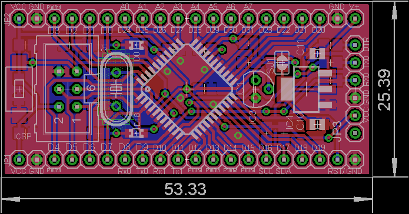

# DevBoard_ATmega1284p
Development board with ATmega1284p (ATmega644pa)

## Features ATmega1284p (ATmega644pa)
- Program Memory 128KB (64KB)
- SRAM 16KB (4KB)
- EEPROM 4KB (2KB)
- 2x UART, 3x SPI, 1x I2C
- 2.5V references
- 2x LED
- ISP
- Arduino  Bootloader via Bluetooth

